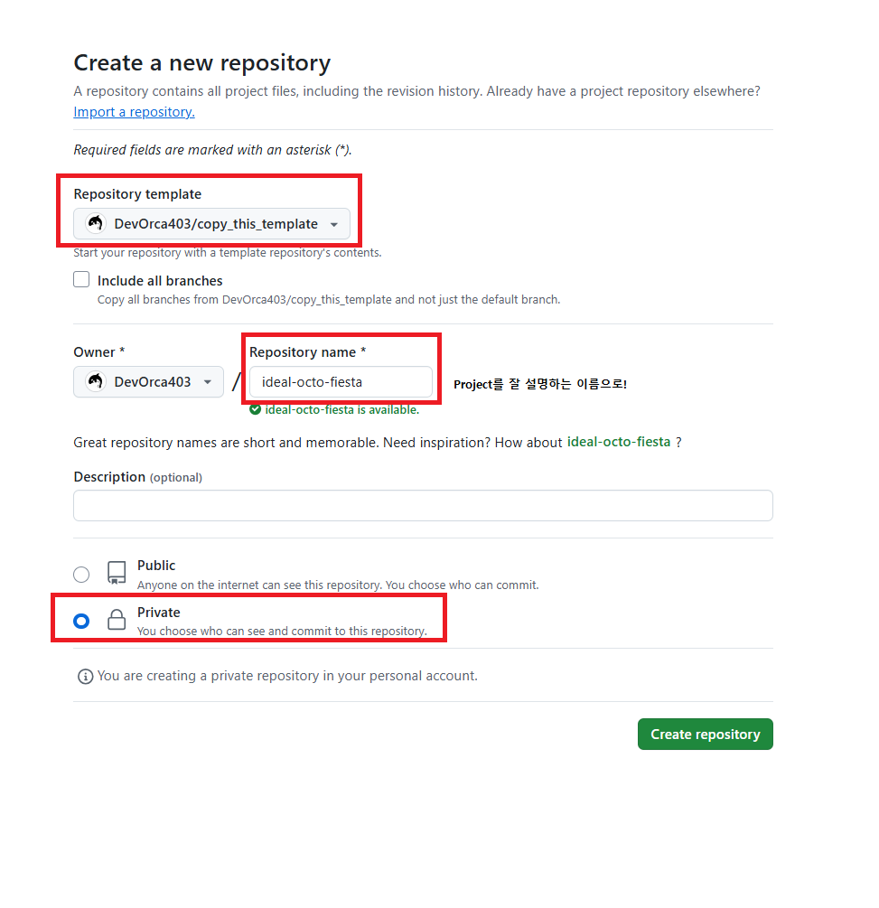
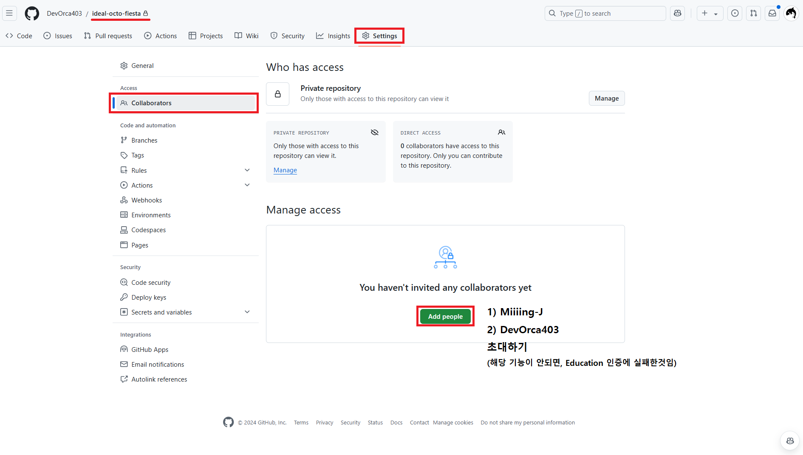
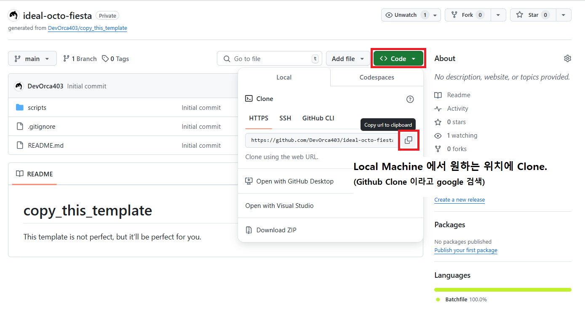

# copy_this_template
## How to use this template

**1. Copy the contents of this repository to your own repository.**  
     
     

**2. Invite T.A.s to your repository.**  
       
  
| T.A.s' Name | T.A.s' GitHub IDs |
|:-----------:|:-----------------:|
| 황윤하       | DevOrca403        |
| 장민영       | Miiiing-J         |
  
**3. Clone your repository to your local machine.**  
       
   여러 방법이 있으므로, 자신에게 맞는 방법을 사용하면 됩니다.  
   (Github Clone 이라고 google 에 검색)  

**4. Activate conda project**  
   ```batch
   "./scripts/initialize.bat"             
   [INITIALIZE] Enter project name:myproject
   [INITIALIZE] Enter python version (default: 3.8):3.11
   [INITIALIZE] Creating conda environment...
   ```  
  
   Project 이름은 Alphanumeric, '-', '_' 만 가능합니다. Python version 은 자유.  
   완료 되었다면, scripts/export.bat, scripts/install.bat 가 생성됨  

**5. git commit and push**  
   자신에게 맞는 방법을 사용.  

## Rules
- ./contents, ./scripts/initialize.bat, ./scripts/export.txt, ./scripts/install.txt 는 Project 진행 간에 삭제.
- ./scripts 경로는 수정 금지.
- README.md 파일 또한 Project 를 잘 설명하는 방식으로 수정.
- scripts/export.bat 는 conda 환경을 export 하는 Script. 필요에 따라 사용.
- **_T.A. 는 git pull, scripts/install.bat 만 실행하여 Project 를 설치하고, main.py 실행할 것임._**